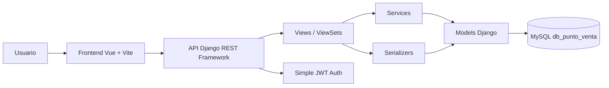
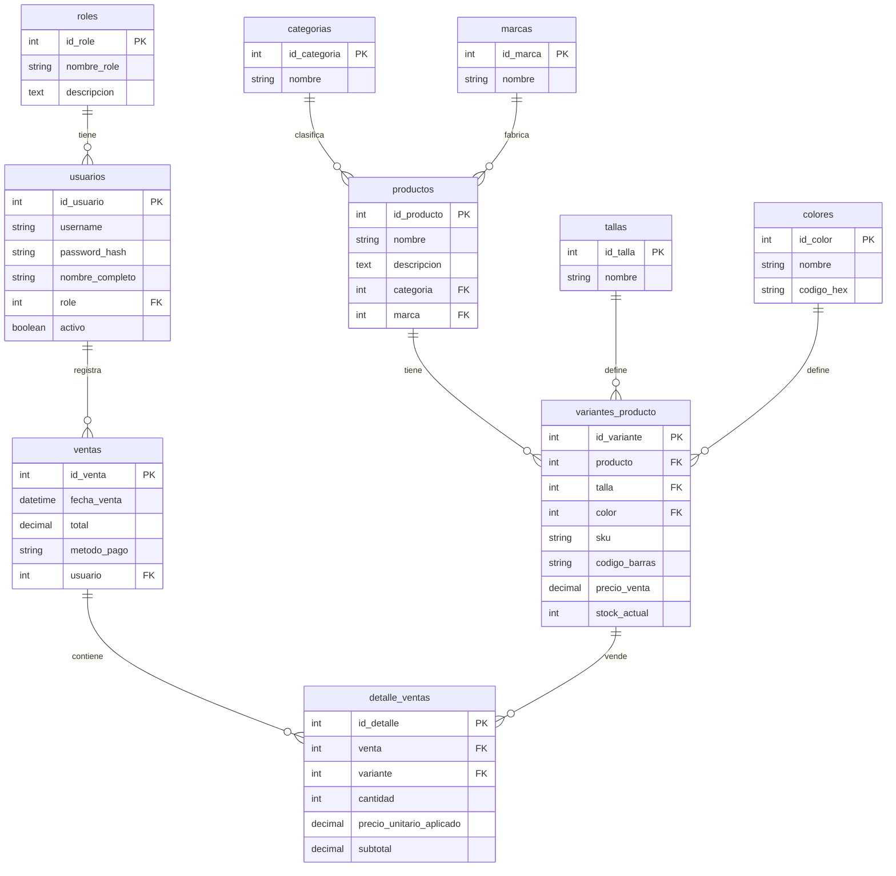

# Punto de venta

Proyecto web para administrar un punto de venta con inventario, catalogos, usuarios y registro de ventas.

## Stack

- Backend: Django, Django REST Framework, Simple JWT
- Base de datos: MySQL
- Frontend: Vue 3, Vite

## Modelo de datos

El backend sigue el modelo de `BD_PUNTOVENTA.pdf`:

- `roles`
- `usuarios`
- `categorias`
- `marcas`
- `tallas`
- `colores`
- `productos`
- `variantes_producto`
- `ventas`
- `detalle_ventas`

Relaciones principales:

- Un usuario pertenece a un rol.
- Un producto pertenece a una categoria y a una marca.
- Una variante pertenece a un producto, una talla y un color.
- Una venta pertenece a un usuario.
- Un detalle de venta pertenece a una venta y a una variante.

## Estructura

```text
backend/
  core/        Configuracion principal de Django
  productos/  Catalogos, productos y variantes
  usuarios/   Roles, usuarios del modelo y autenticacion JWT
  ventas/     Registro de ventas y detalles
frontend/
  src/         Aplicacion Vue
```

## Arquitectura

El backend usa una arquitectura por capas sobre Django REST Framework:

```text
HTTP/API -> views -> serializers -> services -> models -> MySQL
```

- `views.py`: expone endpoints REST y delega operaciones.
- `serializers.py`: valida entrada y transforma modelos a JSON.
- `services.py`: contiene reglas de negocio transaccionales, como registrar ventas y descontar stock.
- `models.py`: define entidades, relaciones y nombres de tablas.
- `exceptions.py`: centraliza errores de dominio para ventas.

El frontend Vue consume la API REST desde `App.vue` y organiza la interfaz en secciones funcionales: catalogos, productos, usuarios y ventas.

## Patrones de diseño

- **Service Layer Pattern**: `ventas/services.py` implementa `VentaService.registrar_venta()` para centralizar la regla de negocio de ventas, validacion de stock y descuento de inventario.
- **Serializer / DTO Pattern**: los serializers de DRF separan la representacion JSON de los modelos Django y validan datos de entrada.
- **Custom Exception Pattern**: `ventas/exceptions.py` define errores de dominio como `InsufficientStockError`.
- **Transaction Script**: las operaciones criticas usan `transaction.atomic` para asegurar consistencia entre venta, detalle y stock.
- **Model Layer Pattern**: los modelos Django representan el esquema relacional y encapsulan relaciones entre tablas.

## Diagramas

### Diagrama de arquitectura



### Modelo ER



## Configuracion del backend

La base de datos oficial del proyecto es **MySQL**. Crear un archivo `backend/.env` tomando como base `backend/.env.example`.

Ejemplo con MySQL:

```text
DJANGO_SECRET_KEY=change-me
DJANGO_DEBUG=True
DJANGO_ALLOWED_HOSTS=127.0.0.1,localhost
DB_ENGINE=django.db.backends.mysql
DB_NAME=db_punto_venta
DB_USER=root
DB_PASSWORD=12345
DB_HOST=127.0.0.1
DB_PORT=3306
```

Crear la base de datos en MySQL antes de ejecutar migraciones:

```sql
CREATE DATABASE db_punto_venta CHARACTER SET utf8mb4 COLLATE utf8mb4_unicode_ci;
```

Instalar dependencias:

```bash
cd backend
python -m pip install -r requirements.txt
```

Aplicar migraciones:

```bash
cd backend
python manage.py migrate
```

Crear administrador:

```bash
cd backend
python manage.py createsuperuser
```

Ejecutar backend:

```bash
cd backend
python manage.py runserver 127.0.0.1:8000
```

## Configuracion del frontend

Instalar dependencias:

```bash
cd frontend
npm install
```

Ejecutar frontend:

```bash
cd frontend
npm run dev -- --host 127.0.0.1
```

La aplicacion consume la API en:

```text
http://127.0.0.1:8000/api/
```

## Docker

El proyecto incluye contenedores para MySQL, Django y Vue.

Levantar todo el entorno:

```bash
docker compose up --build
```

Servicios disponibles:

```text
Frontend: http://127.0.0.1:5173/
Backend:  http://127.0.0.1:8000/api/
MySQL:    127.0.0.1:3306
```

El contenedor del backend ejecuta migraciones antes de iniciar Django. La base de datos se crea automaticamente con el nombre `db_punto_venta` usando MySQL 8.

Detener contenedores:

```bash
docker compose down
```

Eliminar tambien los datos de MySQL del volumen local:

```bash
docker compose down -v
```

## Endpoints principales

```text
POST /api/auth/login/
POST /api/auth/refresh/
GET  /api/auth/me/

GET/POST /api/roles/
GET/POST /api/usuarios/
GET/POST /api/categorias/
GET/POST /api/marcas/
GET/POST /api/tallas/
GET/POST /api/colores/
GET/POST /api/productos/
GET/POST /api/variantes/
GET/POST /api/ventas/
```

## Autenticacion y permisos

La API usa Simple JWT para autenticacion.

- `POST /api/auth/login/`: obtiene tokens de acceso y refresh.
- `GET /api/auth/me/`: requiere token y devuelve el usuario autenticado.
- `GET` en catalogos, productos, usuarios del punto de venta y ventas es publico para facilitar consulta y demostracion.
- `POST`, `PUT`, `PATCH` y `DELETE` requieren un usuario autenticado.
- `/api/auth/usuarios/` queda reservado para usuarios administradores de Django mediante `IsAdminUser`.

El frontend incluye un panel de sesion. Al iniciar sesion, guarda el access token en `localStorage` y lo envia como:

```text
Authorization: Bearer <token>
```

## Pruebas

Backend:

```bash
cd backend
python manage.py check
python manage.py test
```

Frontend:

```bash
cd frontend
npm run build
```

## CI/CD

El repositorio incluye un workflow de GitHub Actions en `.github/workflows/ci.yml`.

El pipeline se ejecuta en cada `push` o `pull_request` hacia `master` o `main` y valida:

- Instalacion de dependencias del backend.
- Servicio MySQL 8 para pruebas.
- Migraciones de Django.
- Tests del backend con `python manage.py test`.
- Instalacion de dependencias del frontend.
- Build de Vue con `npm run build`.

## Flujo de uso

1. Crear roles.
2. Crear usuarios del punto de venta.
3. Crear catalogos: categorias, marcas, tallas y colores.
4. Crear productos.
5. Crear variantes con SKU, codigo de barras, precio y stock.
6. Registrar ventas seleccionando usuario, variante, cantidad y metodo de pago.
